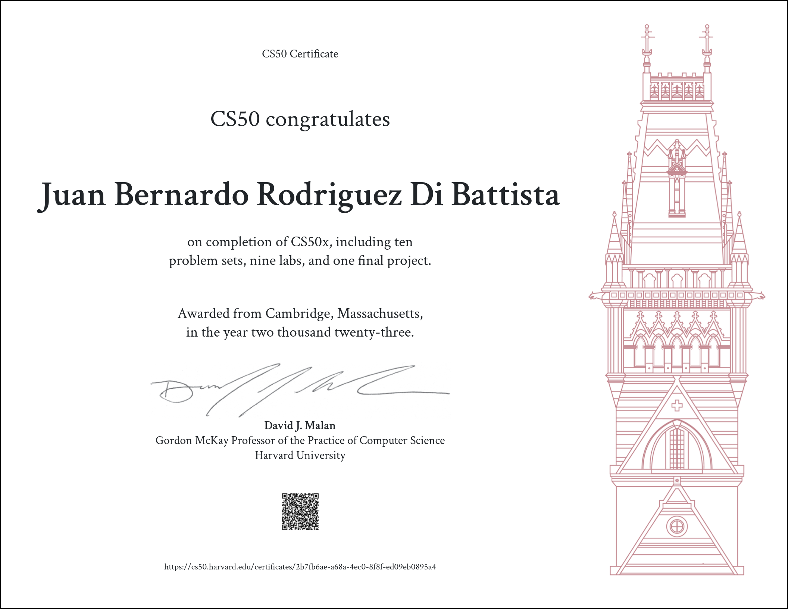

# CS50

## CS50X:
CS50X is a comprehensive online course that provides a solid foundation in computer programming and web development. Throughout the course, I learned a wide range of topics, including C, arrays, algorithms, memory management, data structures, Python, SQL, HTML, CSS, JavaScript, and Flask.

The course started with an introduction to C programming, covering fundamental concepts such as variables, data types, loops, and conditionals. I learned how to write efficient algorithms and manipulate arrays, and gained a deep understanding of memory management and data structures.

As the course progressed, I delved into web development, learning key technologies such as Python, SQL, HTML, CSS, and JavaScript. I gained hands-on experience in building dynamic web applications, designing responsive web pages, and implementing interactive user interfaces using HTML, CSS, and JavaScript.

One of the highlights of the course was learning Flask, a powerful web framework for Python. I gained proficiency in building web applications using Flask, and learned how to implement routing, handle forms, and interact with databases using SQL.

### Week 1:
- Lab:
    + [Population](https://cs50.harvard.edu/x/2023/labs/1/)
- Problem Set:
    1. [Hello](https://cs50.harvard.edu/x/2023/psets/1/hello/)
    1. [Mario](https://cs50.harvard.edu/x/2023/psets/1/mario/more/)
    1. [Cash](https://cs50.harvard.edu/x/2023/psets/1/cash/)
    1. [Credit](https://cs50.harvard.edu/x/2023/psets/1/credit/)

### Week 2:
- Lab:
    + [Scrabble](https://cs50.harvard.edu/x/2023/labs/2/)
- Problem Set:
    1. [Readability](https://cs50.harvard.edu/x/2023/psets/2/readability/)
    1. [Bulbs](https://cs50.harvard.edu/x/2023/psets/2/bulbs/)
    1. [Caesar](https://cs50.harvard.edu/x/2023/psets/2/caesar/)
    1. [Substitution](https://cs50.harvard.edu/x/2023/psets/2/substitution/)
    1. [Wordle](https://cs50.harvard.edu/x/2023/psets/2/wordle50/)

### Week 3:
- Lab:
    + [Sort](https://cs50.harvard.edu/x/2023/labs/3/#lab-3-sort)
- Problem Set:
    1. [Plurality](https://cs50.harvard.edu/x/2023/psets/3/plurality/)
    1. [Tideman](https://cs50.harvard.edu/x/2023/psets/3/tideman/)

### Week 4:
- Lab:
    + [Volume](https://cs50.harvard.edu/x/2023/labs/4/volume/)
- Problem Set:
    1. [Filter More](https://cs50.harvard.edu/x/2023/psets/4/filter/more/)
    1. [Reverse](https://cs50.harvard.edu/x/2023/psets/4/reverse/)
    1. [Recover](https://cs50.harvard.edu/x/2023/psets/4/recover/)

### Week 5:
- Lab:
    + [Inheritance](https://cs50.harvard.edu/x/2023/labs/5/)
- Problem Set:
    1. [Speller](https://cs50.harvard.edu/x/2023/psets/5/speller/)
### Week 6:
- Lab:
    + [World Cup](https://cs50.harvard.edu/x/2023/labs/6/)
- Problem Set:
    1. [DNA](https://cs50.harvard.edu/x/2023/psets/6/dna/)
### Week 7:
- Lab:
    + [Songs](https://cs50.harvard.edu/x/2023/labs/7/)
- Problem Set:
    1. [Movies](https://cs50.harvard.edu/x/2023/psets/7/movies/)
    1. [FiftyVille](https://cs50.harvard.edu/x/2023/psets/7/fiftyville/)
### Week 8:
- Lab:
    + [Trivia](https://cs50.harvard.edu/x/2023/labs/8/)
- Problem Set:
    1. [Homepage](https://cs50.harvard.edu/x/2023/psets/8/homepage/)
### Week 9:
- Lab:
    + [Birthdays](https://cs50.harvard.edu/x/2023/labs/9/)
- Problem Set:
    1. [Finance](https://cs50.harvard.edu/x/2023/psets/9/finance/)

---
## Final Project:
[**To do List**](https://cs50.harvard.edu/x/2023/project/)

